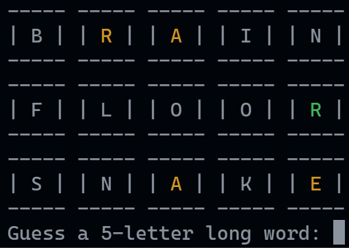

# word-guesser


A word guessing game in the command line



## run

```bash
$ ruby ./lib/main.rb
```

## requirements

-	ruby v2.7

## built with

-   [ruby](https://www.ruby-lang.org/)
-   [freeDictionaryAPI](https://github.com/meetDeveloper/freeDictionaryAPI)

_README generated by [readcli](https://github.com/Tch1b0/readcli)_
